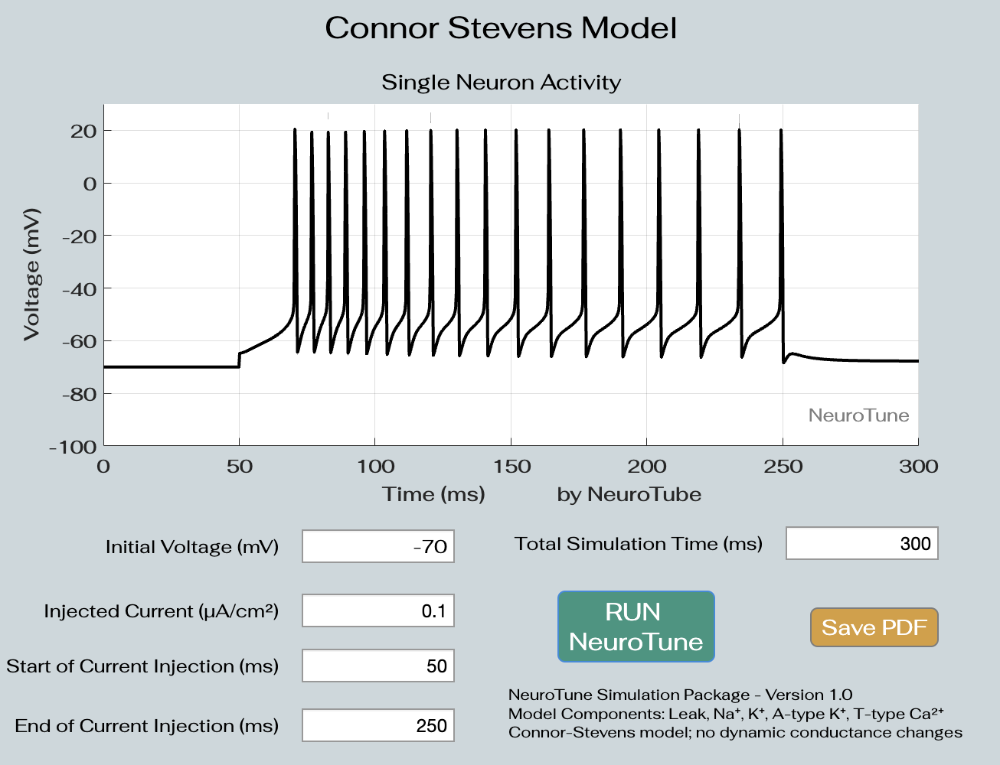

# NeuroTune Simulation Package - Version 1.0

The NeuroTune Simulation Package provides a simplified implementation of the Connor-Stevens model of neuronal dynamics.
It incorporates the key ion currents involved in action potential generation, focusing on Leak, Na⁺, K⁺, A-type K⁺, and T-type Ca²⁺ channels. This model does not include dynamic conductance changes and operates with pre-set ion channel parameters, in reference to Dayan & Abbott, Chapter 6.

Key Features:
• Simulate action potentials based on Hodgkin-Huxley and Connor-Stevens models.
• Model components include Leak, Na⁺, K⁺, A-type K⁺, and T-type Ca²⁺ currents.
• This simulator only gives the user define the initial conditions; initial voltage, injected current,and total simulation time.
Usage:
Define the initial conditions (initial voltage and injected current).
Set the total simulation time and specify the timing of current injections.
Click Run NeuroTune to simulate and visualize the action potential.
The results are displayed on the built-in plotting interface.

When there is no input current and the initial voltage is set to V=-68mV and as expected there is no neural activity.

Increase in the input leads to increased neural activity.

Default parameters reproduce the example shown in Dayan & Abbott, Figure 6.2.
In this example, the current input is set to zero, however the membrane potential is set to -92mV that is highly hyperpolarized.
This hyperpolarization activates: (1) the A-current through the transient K+ conductane, and (2) the T-type Ca2+ conductances. The delay in the spike generation is due to the activated A-currents.

Resources: Dayan, P., & Abbott, L. F. (2001). Theoretical Neuroscience: Computational and Mathematical Modeling of Neural Systems. Chapter 6. MIT Press.

