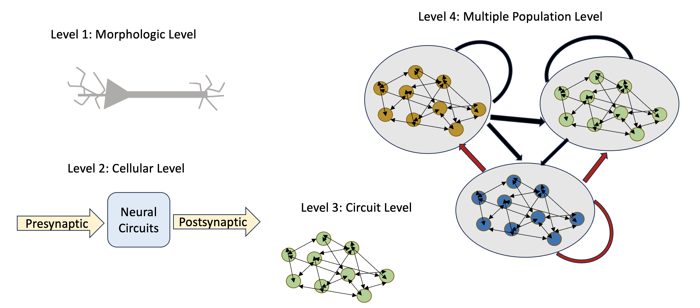
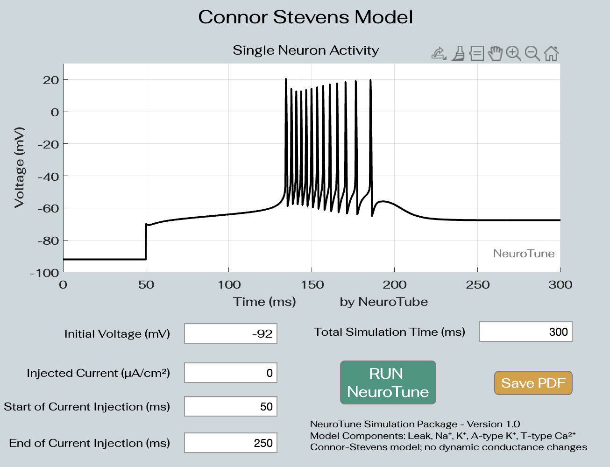

# NeuroTune — Single-Neuron Modeling & Simulations

An educational website and interactive simulator for **single-neuron
computational neuroscience** — the Leaky Integrate-and-Fire, Hodgkin-Huxley,
and Connor-Stevens models, with runnable simulations of neural activity.

**🔗 Live site: [neurotune.github.io](https://neurotune.github.io)**

<p align="center">
  
</p>

## About

NeuroTune presents core models of how single neurons generate electrical
activity, at increasing levels of biophysical detail, grounded in Dayan &
Abbott's *Theoretical Neuroscience* (Ch. 6). Each model has a dedicated page
explaining its equations and components, and a simulations page demonstrating
the resulting spiking behavior.

## Models covered

| Model | What it captures |
|-------|------------------|
| **Leaky Integrate-and-Fire (LIF)** | Simple, efficient subthreshold integration and threshold spiking |
| **Hodgkin-Huxley** | Action potentials via voltage-gated Na⁺ and K⁺ channel dynamics |
| **Connor-Stevens** | Hodgkin-Huxley + a transient A-type K⁺ current for adaptation and delayed firing |

## Simulations

The simulator reproduces classic single-neuron responses — regular spike trains
under injected current, and delayed rebound spikes from hyperpolarization
(Dayan & Abbott, Fig. 6.2), driven by A-type K⁺ and T-type Ca²⁺ currents.

<p align="center">
  
</p>

## Built with

- Hand-written **HTML5 / CSS3** (responsive, mobile-friendly)
- Simulation model: **MATLAB** (Connor-Stevens), with a **Python / Streamlit**
  web port in progress
- Hosted on **GitHub Pages**

## Run locally

The site is fully static — clone and open it, or serve it locally:

```bash
git clone https://github.com/NeuroTune/NeuroTune.github.io.git
cd NeuroTune.github.io
python3 -m http.server 8000
# open http://localhost:8000
```

## Reference

Dayan, P., & Abbott, L. F. (2001). *Theoretical Neuroscience: Computational and
Mathematical Modeling of Neural Systems*, Chapter 6. MIT Press.

## Author

**Tuba Aksoy** — [GitHub](https://github.com/NeuroTune) ·
[LinkedIn](https://www.linkedin.com/in/tbdbx/)
